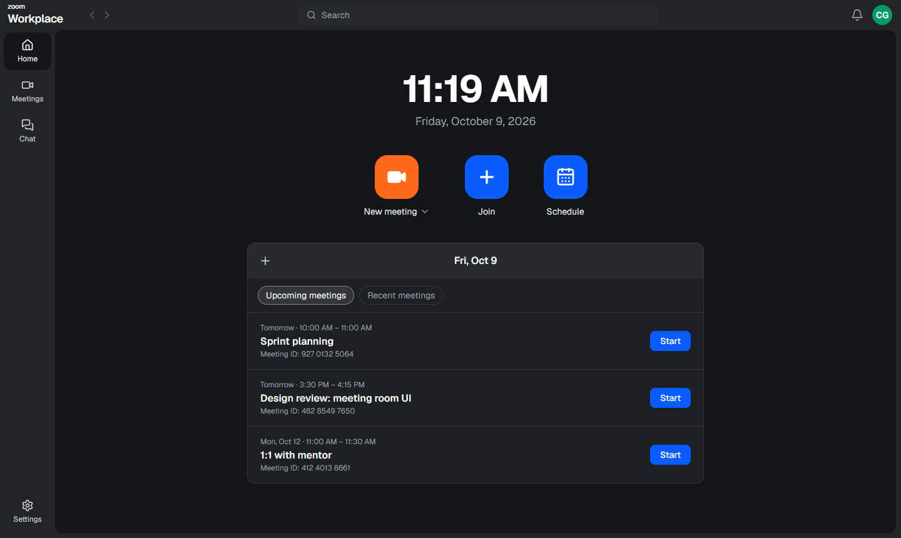
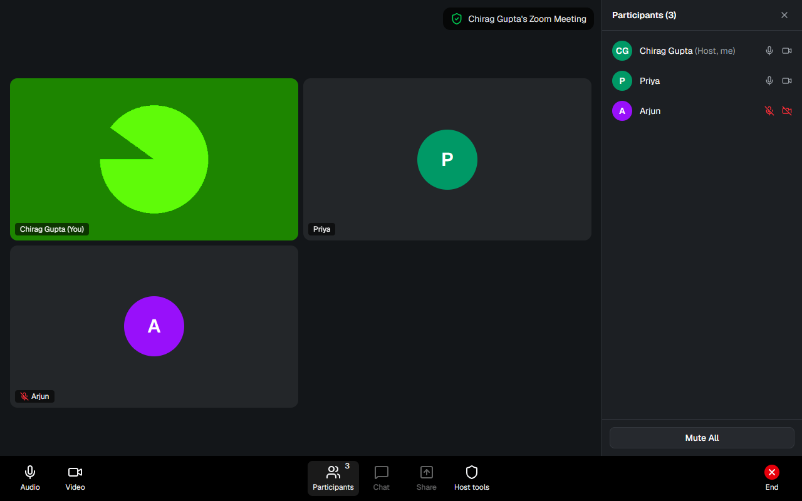
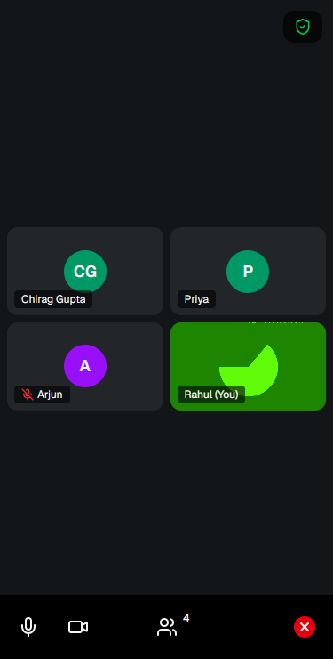

# Zoom Clone

A Zoom-style video meetings web app: a dashboard, instant and scheduled meetings, joining by meeting ID or invite link, and a meeting room with your own camera, a live participant roster over WebSocket, and host controls.



| Meeting room (host view) | Phone |
| --- | --- |
|  |  |

## Features

- **Dashboard**: Zoom-style top nav (profile and settings placeholders), New meeting / Join / Schedule tiles, a live clock card, Upcoming and Recent meetings
- **Instant meeting**: unique 11-digit meeting ID, 6-character passcode and invite link (`/j/<id>?pwd=<passcode>`), straight into the room as host
- **Join**: by meeting ID (`842 1397 6502`, dashes or spaces are fine) or a pasted invite link, which fills in the passcode. Display name and passcode are required. The backend checks the meeting exists, the passcode matches and the meeting hasn't ended.
- **Schedule**: topic, description, date, time and duration. Stored in UTC, shown in local time under Upcoming, with a **Start** button.
- **Meeting room**: pre-join preview with mic and camera toggles, your own webcam via `getUserMedia`, everyone else as avatar tiles, a Zoom bottom toolbar, a participants panel, and the live roster (joins, leaves, mute and camera state) over a FastAPI WebSocket
- **Host controls (bonus)**: Mute All (toolbar **Host tools** or the participants panel); mute or remove one person from the participants panel or by hovering their video tile (removed people can't rejoin under the same name); End Meeting for All
- **Zoom Workplace look**: dark theme modelled on the current Zoom app (top bar and side rail, big clock, meetings card with Upcoming / Recent tabs, black meeting toolbar with Host tools and the red End button)
- **Responsive (bonus)**: works at phone width; the participants panel becomes a full-screen sheet
- **No auth**: one seeded default user is always "logged in" and hosts every meeting they create

There is deliberately no WebRTC: you see your own camera, and other people appear as avatar tiles with their live mic and camera state.

## Tech stack

| Part | Tech |
| --- | --- |
| `frontend/` | Next.js 16 (App Router), React 19, TypeScript, Tailwind CSS 4, lucide-react icons |
| `backend/` | FastAPI, SQLAlchemy 2.0, Pydantic v2, SQLite, pytest |

## Running locally

You need Python 3.12+ and Node.js 20+.

### 1. Backend (http://localhost:8000)

```bash
cd backend
python -m venv .venv
# Windows: .venv\Scripts\activate    macOS/Linux: source .venv/bin/activate
pip install -r requirements.txt
fastapi dev app/main.py
```

On startup it creates `backend/zoom.db` and seeds the default user. Interactive API docs are at http://localhost:8000/docs.

### 2. Frontend (http://localhost:3000)

```bash
cd frontend
cp .env.local.example .env.local   # NEXT_PUBLIC_API_URL=http://localhost:8000
npm install
npm run dev
```

**Try it with several people:** start a meeting, copy the invite link from the ⓘ meeting info button, and open it in another browser or a private window.

### Tests and checks

```bash
cd backend && pytest                      # 34 tests: REST API, WebSocket roster, host controls, CORS
cd frontend && npm run lint && npm run build
```

### Configuration

| Variable | Where | Default |
| --- | --- | --- |
| `NEXT_PUBLIC_API_URL` | frontend | `http://localhost:8000` |
| `FRONTEND_URL` | backend, used to build invite links | `http://localhost:3000` |
| `CORS_ORIGINS` | backend, comma-separated frontend URLs allowed to call the API | `http://localhost:3000` |
| `DATABASE_URL` | backend | `sqlite:///backend/zoom.db` |

## Deploying

Backend on [Render](https://render.com) (it needs a host that keeps WebSocket connections open), frontend on [Vercel](https://vercel.com). Guests join from any device with just the invite link; HTTPS on both hosts lets the browser use their camera.

1. **Backend: Render → New → Web Service**, from this repo:

   | Setting | Value |
   | --- | --- |
   | Root Directory | `backend` |
   | Build Command | `pip install -r requirements.txt` |
   | Start Command | `fastapi run app/main.py --port $PORT` |
   | Health Check Path | `/api/health` |
   | Environment | `PYTHON_VERSION=3.12.7` |

   Check that `https://<backend>.onrender.com/api/health` returns `{"status":"ok"}`.
2. **Frontend: Vercel → Add New → Project**, from this repo, with Root Directory `frontend` and `NEXT_PUBLIC_API_URL=https://<backend>.onrender.com`. `NEXT_PUBLIC_` variables are baked in at build time, so redeploy after changing them.
3. **Connect them:** in Render set `CORS_ORIGINS` and `FRONTEND_URL` to `https://<frontend>.vercel.app`. Render redeploys on its own.

Notes:
- **Run a single backend instance.** Live rosters are in that process's memory (see [design decisions](#design-decisions-and-trade-offs)).
- **Render's free tier sleeps** after about 15 idle minutes, so the first request takes 30–60 s. Its disk is also reset on redeploy, which clears the SQLite data.
- **There is no login,** so anyone who opens the dashboard acts as the default user. Share invite links, not the dashboard.

| Symptom | Likely cause |
| --- | --- |
| "Can't reach the server" | wrong `NEXT_PUBLIC_API_URL`, frontend not redeployed, or the backend is still waking up |
| CORS error in the browser console | `CORS_ORIGINS` doesn't exactly match the frontend URL |
| Render build fails | Root Directory isn't `backend` |

## Project structure

```
backend/
  app/
    main.py            FastAPI app: CORS, routers, create tables + seed on startup
    database.py        engine, session factory, get_db dependency, SQLite foreign keys on
    models.py          SQLAlchemy models: User, Meeting, Participant
    schemas.py         Pydantic request/response models
    seed.py, deps.py   default user, and get_current_user (stand-in for auth)
    utils.py           meeting ID and passcode generation
    realtime.py        ConnectionManager: in-memory live rosters per meeting
    routers/
      users.py         GET /api/me
      meetings.py      meeting REST endpoints
      ws.py            meeting WebSocket and host commands
  tests/               pytest: per-test SQLite file, one event loop like uvicorn
frontend/
  app/                 routes: / (dashboard), /join, /j/[code] (invite link), /meeting/[code]
  components/
    dashboard/         TopNav, ActionTiles, ClockCard, Upcoming/RecentMeetings, ScheduleModal
    join/              JoinForm, JoinCard
    meeting/           MeetingRoom, PreJoin, VideoGrid, VideoTile, Toolbar, ParticipantsPanel, MeetingInfo
    ui/                Avatar, Modal
  hooks/
    useLocalMedia.ts   camera and mic: getUserMedia, toggles, cleanup
    useMeetingSocket.ts  WebSocket connection and live roster state
  lib/                 api.ts (typed fetch), types.ts, format.ts, meeting-link.ts
```

## Database schema (SQLite)

```
users                     meetings                                 participants (attendance log)
-----                     --------                                 ------------
id          PK            id               PK                      id            PK
name                      code             UNIQUE, 11 digits       meeting_id    FK -> meetings  ON DELETE CASCADE, indexed
email       UNIQUE        passcode                                 user_id       FK -> users     ON DELETE SET NULL (NULL = guest)
created_at                host_id          FK -> users  CASCADE    display_name
                          type             CHECK instant|scheduled is_host
                          title, description                       joined_at, left_at
                          scheduled_start  (UTC)                   removed       (blocks rejoining)
                          duration_minutes CHECK > 0
                          started_at, ended_at, created_at
                          INDEX (host_id, scheduled_start)
```

- **The meeting `code` is TEXT, not a number.** It's an identifier that is never used in arithmetic, and the integer `id` stays internal for joins.
- **Uniqueness of `code` comes from the UNIQUE constraint.** Creation retries if a random code collides.
- **There is no `status` column.** Status is derived from the timestamps: live = `started_at` set and `ended_at` null; ended = `ended_at` set. Storing it twice would allow the two to disagree.
- **SQLite has no timezone type,** so every datetime is stored as naive UTC. The API tags responses as UTC (`...Z`), and the browser shows local time.
- **Foreign keys are switched on** with `PRAGMA foreign_keys=ON` on every connection. SQLite ignores them otherwise.

## API

### REST (`/api`)

| Method | Path | Purpose | Errors |
| --- | --- | --- | --- |
| GET | `/me` | the default user | |
| POST | `/meetings/instant` | create and start an instant meeting | |
| POST | `/meetings` | schedule `{title, description?, start_time, duration_minutes}` | 422 for a past time or a time without an offset |
| GET | `/meetings/upcoming` | scheduled meetings whose end time is still ahead | |
| GET | `/meetings/recent` | started meetings, with participant count | |
| GET | `/meetings/{code}` | public info for join screens (no passcode) | 404 |
| POST | `/meetings/{code}/join` | check `{passcode, display_name}` before entering | 404, 403 wrong passcode, 410 ended |

### WebSocket `/ws/meetings/{code}`

The first message must be `join`. The server applies the same rules as the REST join check.

| Client → server | Payload |
| --- | --- |
| `join` | `display_name, passcode, user_id?, audio, video` |
| `media_state` | `audio, video` |
| `mute_all` *(host)* | |
| `remove_participant` *(host)* | `participant_id` |
| `end_meeting` *(host)* | |

| Server → client | Payload | Sent to |
| --- | --- | --- |
| `welcome` | `self_id, is_host, participants[]` | the newcomer |
| `participant_joined` / `participant_updated` | `participant` | others / everyone |
| `participant_left` | `participant_id` | everyone |
| `force_mute` | | everyone except the host |
| `removed` | | the removed person, then close **4003** |
| `meeting_ended` | | everyone, then close **4004** |
| `error` | `message` | the sender. Before `welcome` this means "can't join", followed by close **4001**. |

## Design decisions and trade-offs

- **The live roster is in memory** (`realtime.py`), because WebSocket connections only exist in this server process. The `participants` table is the durable attendance log. Running several server processes would need shared state, for example Redis pub/sub.
- **The host is whoever joins with `user_id == meeting.host_id`.** That trusts the client, which is acceptable only because the assignment has no auth.
- **Removed people are blocked by display name** (case-insensitive). Guests have no accounts, so the name is the only identity available; someone could rejoin under a different name.
- **Mic and camera toggles flip `track.enabled`** rather than stopping the track. It's instant and needs no new permission prompt. An effect keeps the server in sync with the local state, which also covers a camera that becomes ready after you've joined.
- **Next.js pages read the URL on the server, then hand off to client components** for state, media and sockets. Data loads from FastAPI in the browser.

## Not in scope

Real audio and video between participants (WebRTC), chat, screen sharing, recording and authentication. Chat and Share Screen appear in the toolbar as disabled placeholders to match Zoom's layout.

More screenshots: [join](docs/screenshots/join.png) · [pre-join](docs/screenshots/prejoin.png) · [schedule](docs/screenshots/schedule.png)
